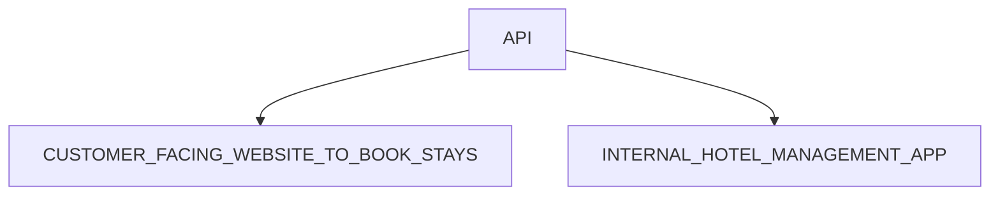

## The Wild Oasis 프로젝트 - 고객 웹 사이트

> [!TIP]
> The Wild Oasis는 고객을 위한 웹사이트로, Wild Oasis 호텔의 서비스와 객실 정보를 제공하며, 예약 관리를 쉽게 할 수 있도록 설계된 플랫폼입니다. 이 웹사이트는 잠재 고객 및 실제 숙박 고객을 대상으로 하며, 고객이 필요한 정보를 확인하고 편리하게 예약을 관리할 수 있는 기능을 제공합니다.

### API

이 링크 방문하시고 확인 가능 👉 [INTERNAL HOTEL MANAGEMENT APP](https://github.com/BekCodingAddict/The-Wild-Oasis)

## 주요 기능
### 1.호텔 정보 열람
- Wild Oasis 호텔 및 각 객실(캐빈)의 세부 정보를 확인할 수 있습니다.
- 각 캐빈의 최대 수용 인원과 예약 가능 날짜를 확인 가능합니다.

### 2.캐빈 필터링 및 예약
- 최대 수용 인원을 기준으로 캐빈을 필터링할 수 있습니다.
- 특정 날짜 범위에 예약 가능한 캐빈을 검색할 수 있습니다.
- 온라인 결제는 지원되지 않으며, 체크인 시 현장에서 결제하도록 설정됩니다.
  - 신규 예약 상태는 “미확정”(예약 완료, 체크인 대기)으로 설정됩니다.
 
### 3.예약 관리
- 고객은 자신의 과거 및 미래 예약 기록을 확인할 수 있습니다.
- 예약 정보를 업데이트하거나 삭제할 수 있습니다.

### 4.회원 가입 및 로그인
- 예약 및 예약 관리 기능을 사용하려면 회원 가입 및 로그인이 필요합니다.
- 회원 가입 시 고객의 프로필이 데이터베이스에 생성됩니다.

### 5.프로필 관리
- 고객은 기본 정보를 설정 및 업데이트할 수 있습니다.
- 업데이트된 프로필 정보는 체크인 과정을 더욱 빠르고 간편하게 만듭니다.

### FEATURES+PAGES

| Feature Category | Necessary pages  | URL Params          |
| ---------------- | ---------------- | ------------------- |
|Homepage     |     Homepage            |       /       |
| About        | About page        | /about          |
| Cabins           | Cabin overview          | /cabins/            |
| Cabins           | Cabin details          | /cabins/:cabinId            |
| Reservations    | Cabin details     | /cabins/:cabinId         |
| Reservations    | Reservation list     | /account/reservations         |
| Reservations    | Edit reservation      | /account/reservations/edit         |
| Authentication   | Login            | /login              |
| profile   | update profile | /account/profile            |

### Technologies and Tools:

&nbsp;
&nbsp;
&nbsp;
&nbsp;
&nbsp;
&nbsp;
&nbsp;
&nbsp;

## 얻은 성과 및 배운 점:
>### 성과
### 1.Next.js 활용
- **서버 사이드 렌더링(SSR)**과 **정적 사이트 생성(SSG)**을 효과적으로 적용하여 애플리케이션의 성능을 최적화했습니다.
- Next.js의 내장된 라우팅 시스템과 API 라우트 기능을 활용하여 빠르고 안정적인 사용자 경험을 제공했습니다.

### 2.상태 관리 및 API 통합
- Supabase를 사용하여 데이터베이스 연동 및 인증 기능을 구현했습니다.
- 사용자 인증 및 세션 관리에 NextAuth.js를 통합하여 보안성을 강화했습니다.

### 3.날짜와 시간 관리
- date-fns 라이브러리를 사용해 날짜와 시간 데이터를 효과적으로 관리했습니다.
- 예약, 이벤트 관리 등의 기능을 구현하여 사용자 경험을 개선했습니다.

### 4.UI/UX 개선
- Tailwind CSS와 Heroicons를 사용해 직관적인 사용자 인터페이스를 구현했습니다.
- 간결하고 유지보수가 용이한 스타일링 방식을 적용했습니다.

### 5.개발 환경 최적화
- ESLint와 Next.js 내장된 린트 설정을 활용하여 코드 품질을 유지했습니다.
- 개발 속도를 높이고 오류를 줄이기 위해 dotenv로 환경 변수를 관리했습니다.

>### 배운 점
### 1.Next.js의 잘 이해
- Next.js의 다양한 렌더링 방식(SSR, SSG, CSR)을 학습하고 프로젝트에 적절히 적용하는 방법을 배웠습니다.
- 라우팅, 이미지 최적화, API 경로와 같은 Next.js의 핵심 기능을 활용하는 실무 경험을 쌓았습니다.
  
### 2.백엔드와의 통합
- Supabase와 같은 서버리스 데이터베이스를 사용하여 효율적인 데이터 관리와 API 설계를 다시 한번 익혔습니다.
- 인증 및 데이터베이스 연동과 관련된 문제를 해결하며 보안의 중요성을 이해했습니다.

### 3.효율적인 상태 관리
- React와 Next.js 환경에서 서버 상태와 클라이언트 상태를 분리 관리하는 방법을 배웠습니다.
- 프로젝트의 확장성을 고려해 상태 관리 및 데이터 흐름을 설계하는 것을 겅험해 봤습니다.

### 4.디자인 시스템과 사용자 경험
- Tailwind CSS와 Heroicons를 활용하여 재사용 가능한 컴포넌트를 설계하고, 일관된 디자인 시스템을 구축하는 것을 경험했습니다

### 5.생산성과 협업 기술
- 패키지 관리, 의존성 업데이트, 효율적인 개발 워크플로를 경험하며 실제 프로젝트 환경에서의 협업 기술을 향상시켰습니다.
- 린트와 코드 규칙을 준수하며 팀 환경에서도 유지보수가 쉬운 코드를 작성하는 능력을 배웠습니다.

## 앞으로 추가해야 할 점들:
### 1.반응형 디자인의 구현과 테스트 과정을 통해 다양한 디바이스에서의 사용자 경험을 최적화하는 것
