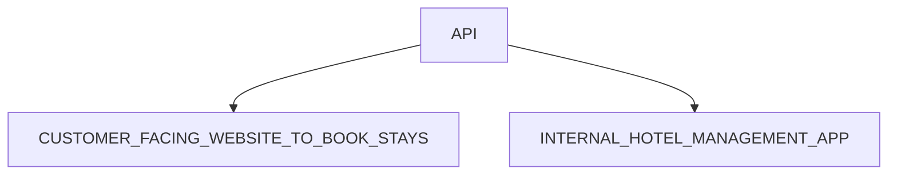

## The Wild Oasis 프로젝트 - 고객 웹 사이트

> [!TIP]
> The Wild Oasis는 고객을 위한 웹사이트로, Wild Oasis 호텔의 서비스와 객실 정보를 제공하며, 예약 관리를 쉽게 할 수 있도록 설계된 플랫폼입니다. 이 웹사이트는 잠재 고객 및 실제 숙박 고객을 대상으로 하며, 고객이 필요한 정보를 확인하고 편리하게 예약을 관리할 수 있는 기능을 제공합니다.

### API

이 링크 방문하시고 확인 가능 👉 [INTERNAL HOTEL MANAGEMENT APP](https://github.com/BekCodingAddict/The-Wild-Oasis)

## 주요 기능
### 1.호텔 정보 열람
- Wild Oasis 호텔 및 각 객실(캐빈)의 세부 정보를 확인할 수 있습니다.
- 각 캐빈의 최대 수용 인원과 예약 가능 날짜를 확인 가능합니다.

### 2.캐빈 필터링 및 예약
- 최대 수용 인원을 기준으로 캐빈을 필터링할 수 있습니다.
- 특정 날짜 범위에 예약 가능한 캐빈을 검색할 수 있습니다.
- 온라인 결제는 지원되지 않으며, 체크인 시 현장에서 결제하도록 설정됩니다.
  - 신규 예약 상태는 “미확정”(예약 완료, 체크인 대기)으로 설정됩니다.
 
### 3.예약 관리
- 고객은 자신의 과거 및 미래 예약 기록을 확인할 수 있습니다.
- 예약 정보를 업데이트하거나 삭제할 수 있습니다.

### 4.회원 가입 및 로그인
- 예약 및 예약 관리 기능을 사용하려면 회원 가입 및 로그인이 필요합니다.
- 회원 가입 시 고객의 프로필이 데이터베이스에 생성됩니다.

### 5.프로필 관리
- 고객은 기본 정보를 설정 및 업데이트할 수 있습니다.
- 업데이트된 프로필 정보는 체크인 과정을 더욱 빠르고 간편하게 만듭니다.

### FEATURES+PAGES

| Feature Category | Necessary pages  | URL Params          |
| ---------------- | ---------------- | ------------------- |
|Homepage     |     Homepage            |       /       |
| About        | About page        | /about          |
| Cabins           | Cabin overview          | /cabins/            |
| Cabins           | Cabin details          | /cabins/:cabinId            |
| Reservations    | Cabin details     | /cabins/:cabinId         |
| Reservations    | Reservation list     | /account/reservations         |
| Reservations    | Edit reservation      | /account/reservations/edit         |
| Authentication   | Login            | /login              |
| profile   | update profile | /account/profile            |

### Technologies and Tools:

&nbsp;
&nbsp;
&nbsp;
&nbsp;
&nbsp;
&nbsp;
&nbsp;
&nbsp;
